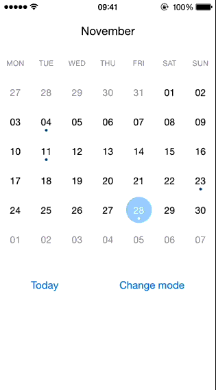

# JTCalendar

[](https://travis-ci.org/jonathantribouharet/JTCalendar)

[](https://github.com/Carthage/Carthage)


JTCalendar is an easily customizable calendar control for iOS.

## Installation

With [CocoaPods](http://cocoapods.org), add this line to your Podfile.

    pod 'JTCalendar', '~> 2.0'

### Carthage

To use this project with [Carthage](https://github.com/Carthage/Carthage), add this line to your Cartfile.

    github "jonathantribouharet/JTCalendar" ~> 2.2

## Screenshots




### Warning

The part below the calendar in the 2nd screenshot is not provided.

## Features

- horizontal and vertical calendar
- highly customizable either by subclassing default class provided or by creating your own class implementing a protocol
- support internationalization
- week view mode
- limited range, you can define a start and an end to you calendar

## Usage

### Basic usage

You have to create two views in your `UIViewController`:

- The first view is `JTCalendarMenuView` and it represents the part with the months names. This view is optional.
- The second view is `JTHorizontalCalendarView` or `JTVerticalCalendarView`, it represents the calendar itself.

Your `UIViewController` have to implement `JTCalendarDelegate`, all methods are optional.

```objective-c
#import <UIKit/UIKit.h>

#import <JTCalendar/JTCalendar.h>

@interface ViewController : UIViewController<JTCalendarDelegate>

@property (weak, nonatomic) IBOutlet JTCalendarMenuView *calendarMenuView;
@property (weak, nonatomic) IBOutlet JTHorizontalCalendarView *calendarContentView;

@property (strong, nonatomic) JTCalendarManager *calendarManager;

@end
```

`JTCalendarManager` is used to coordinate `calendarMenuView` and `calendarContentView` and provide a default behavior.

```objective-c
@implementation ViewController

- (void)viewDidLoad
{
    [super viewDidLoad];
        
    _calendarManager = [JTCalendarManager new];
    _calendarManager.delegate = self;
    
    [_calendarManager setMenuView:_calendarMenuView];
    [_calendarManager setContentView:_calendarContentView];
    [_calendarManager setDate:[NSDate date]];
}

@end

```

The Example project contains some use cases you may check before asking questions.

### Advanced usage

Even if all methods of `JTCalendarManager` are optional you won't get far without implementing at least the two next methods:
- `calendar:prepareDayView:` this method is used to customize the design of the day view for a specific date. This method is called each time a new date is set in a dayView or each time the current page change. You can force the call to this method by calling `[_calendarManager reload];`.


```objective-c
- (void)calendar:(JTCalendarManager *)calendar prepareDayView:(JTCalendarDayView *)dayView
{
    dayView.hidden = NO;
    
    // Test if the dayView is from another month than the page
    // Use only in month mode for indicate the day of the previous or next month
    if([dayView isFromAnotherMonth]){ 
        dayView.hidden = YES;
    }
    // Today
    else if([_calendarManager.dateHelper date:[NSDate date] isTheSameDayThan:dayView.date]){
        dayView.circleView.hidden = NO;
        dayView.circleView.backgroundColor = [UIColor blueColor];
        dayView.dotView.backgroundColor = [UIColor whiteColor];
        dayView.textLabel.textColor = [UIColor whiteColor];
    }
    // Selected date
    else if(_dateSelected && [_calendarManager.dateHelper date:_dateSelected isTheSameDayThan:dayView.date]){
        dayView.circleView.hidden = NO;
        dayView.circleView.backgroundColor = [UIColor redColor];
        dayView.dotView.backgroundColor = [UIColor whiteColor];
        dayView.textLabel.textColor = [UIColor whiteColor];
    }
    // Another day of the current month
    else{
        dayView.circleView.hidden = YES;
        dayView.dotView.backgroundColor = [UIColor redColor];
        dayView.textLabel.textColor = [UIColor blackColor];
    }
    
    // Your method to test if a date have an event for example
    if([self haveEventForDay:dayView.date]){
        dayView.dotView.hidden = NO;
    }
    else{
        dayView.dotView.hidden = YES;
    }
}
```

- `calendar:didTouchDayView:` this method is used to respond to a touch on a dayView. For example you can indicate to display another month if dayView is from another month.

```objective-c
- (void)calendar:(JTCalendarManager *)calendar didTouchDayView:(JTCalendarDayView *)dayView
{
    // Use to indicate the selected date
    _dateSelected = dayView.date;
    
    // Animation for the circleView
    dayView.circleView.transform = CGAffineTransformScale(CGAffineTransformIdentity, 0.1, 0.1);
    [UIView transitionWithView:dayView
                      duration:.3
                       options:0
                    animations:^{
                        dayView.circleView.transform = CGAffineTransformIdentity;
                        [_calendarManager reload];
                    } completion:nil];
    
    // Load the previous or next page if touch a day from another month
    if(![_calendarManager.dateHelper date:_calendarContentView.date isTheSameMonthThan:dayView.date]){
        if([_calendarContentView.date compare:dayView.date] == NSOrderedAscending){
            [_calendarContentView loadNextPageWithAnimation];
        }
        else{
            [_calendarContentView loadPreviousPageWithAnimation];
        }
    }
}
```

### Switch to week view

If you want see just one week at a time, you have to set the `isWeekMode` to `YES` and reload the calendar.

```objective-c
_calendarManager.settings.weekModeEnabled = YES;
[_calendarManager reload];
```

#### WARNING

When you change the mode, it doesn't change the height of `calendarContentView`, you have to do it yourself.
See the Example project for more details.

### Customize the design

For customize the design you have to implement some methods depending of what parts you want to custom. Check the [JTCalendarDelegate](JTCalendar/JTCalendarDelegate.h) file and the Example project.

For example:

```objective-c
// This method is independent from the date, it's call only at the creation of the dayView.
// For customize the dayView depending of the date use `prepareDayView` method
- (UIView<JTCalendarDay> *)calendarBuildDayView:(JTCalendarManager *)calendar
{
    JTCalendarDayView *view = [JTCalendarDayView new];
    view.textLabel.font = [UIFont fontWithName:@"Avenir-Light" size:13];
    view.textLabel.textColor = [UIColor blackColor];
    
    return view;
}
```

### Pagination

The content views (`JTHorizontalCalendarView` and `JTVerticalCalendarView`) are just subclass of `UIScrollView`.
Each time the current page change, `calendarDidLoadNextPage` or `calendarDidLoadPreviousPage` is called.
The content views provide two method for display the previous or next page with an animation `loadNextPageWithAnimation` and `loadPreviousPageWithAnimation`.
You can limit the range of the calendar by implementing `canDisplayPageWithDate` method.

```objective-c
// Used to limit the date for the calendar
- (BOOL)calendar:(JTCalendarManager *)calendar canDisplayPageWithDate:(NSDate *)date
{
    return [_calendarManager.dateHelper date:date isEqualOrAfter:_minDate andEqualOrBefore:_maxDate];
}
```

### Vertical calendar

If you use `JTVerticalCalendarView` for having a vertical calendar, you have some settings you have to set.

```objective-c
- (void)viewDidLoad
{
    [super viewDidLoad];
    
    _calendarManager = [JTCalendarManager new];
    _calendarManager.delegate = self;
    
    _calendarManager.settings.pageViewHaveWeekDaysView = NO; // You don't want WeekDaysView in the contentView
    _calendarManager.settings.pageViewNumberOfWeeks = 0; // Automatic number of weeks
    
    _weekDayView.manager = _calendarManager; // You set the manager for WeekDaysView
    [_weekDayView reload]; // You load WeekDaysView manually

    [_calendarManager setMenuView:_calendarMenuView];
    [_calendarManager setContentView:_calendarContentView];
    [_calendarManager setDate:[NSDate date]];
    
    _calendarMenuView.scrollView.scrollEnabled = NO; // The scroll is not supported with JTVerticalCalendarView
}
```

### Internationalization / Localization (change first weekday)

For changing the locale and the timeZone just do:

```objective-c
_calendarManager.dateHelper.calendar.timeZone = [NSTimeZone timeZoneWithAbbreviation:@"CDT"];
_calendarManager.dateHelper.calendar.locale = [NSLocale localeWithLocaleIdentifier:@"fr_FR"];
[_calendarManager reload];
```
For changing locale and timeZone in Swift use:

```swift
let locale = Locale(identifier: "fr_FR")
let timeZone = TimeZone.init(abbreviation: "CDT")
calendarManager = JTCalendarManager(locale: locale, andTimeZone: timeZone)
```

### Date comparaison

Be careful when you compare two different dates, you have to take care of the time zone.
An helper is provided for some basic operations:

```objective-c
[_calendarManager.dateHelper date:dateA isTheSameMonthThan:dateB];
[_calendarManager.dateHelper date:dateA isTheSameWeekThan:dateB];
[_calendarManager.dateHelper date:dateA isTheSameDayThan:dateB];

// Use to limit the calendar range
[_calendarManager.dateHelper date:date isEqualOrAfter:minDate andEqualOrBefore:maxDate];

```

### Optimization

Every methods in the delegate are called in the main thread, you have to be really careful, in particular in the `prepareDayView` method which is called very often.

If you have to fetch some data from something slow, I recommend to create a cache and query this cache in `prepareDayView` method.
You have to cache the data from the next pages and update this cache asynchronously (in another thread via `dispatch_async`) when a new page is loaded (via `calendarDidLoadNextPage` and `calendarDidLoadPreviousPage` methods).

## Questions

Before asking any questions be sure to explore the Example project.
Check also [JTCalendarDelegate](JTCalendar/JTCalendarDelegate.h) and [JTCalendarSettings](JTCalendar/JTCalendarSettings.h) files.

Don't use `NSLog` to print date use a `NSDateFormatter`, `NSLog`doesn't take care of the timezone.

```objective-c
NSDateFormatter *dateFormatter = [_calendarManager.dateHelper createDateFormatter];
dateFormatter.dateFormat = @"yyyy'-'MM'-'dd' 'HH':'mm':'ss";
NSLog(@"%@", [dateFormatter stringFromDate:yourDate]);
```

## Requirements

- iOS 7 or higher
- Automatic Reference Counting (ARC)

## Author

- [Jonathan VUKOVICH TRIBOUHARET](https://github.com/jonathantribouharet) ([@johnvuko](https://twitter.com/johnvuko))

## License

JTCalendar is released under the MIT license. See the LICENSE file for more info.
